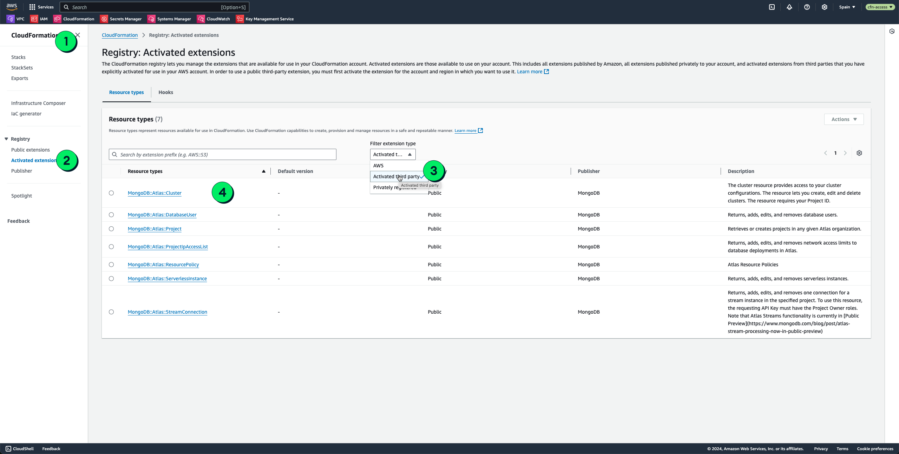
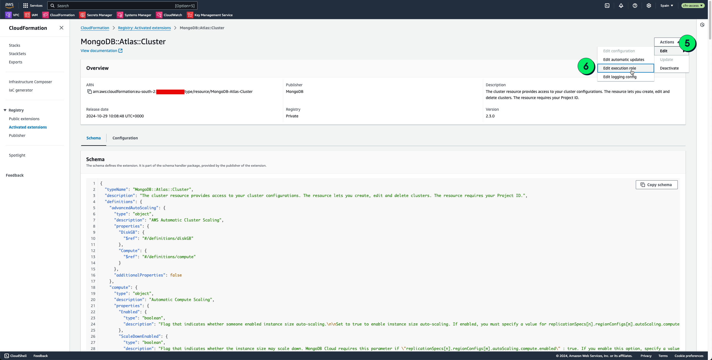
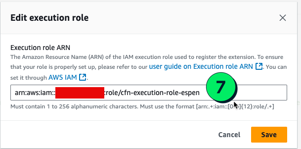

# MongoDB Atlas AWS CloudFormation Resources
[](https://github.com/mongodb/mongodbatlas-cloudformation-resources/actions/workflows/code-health.yaml)
[](https://github.com/mongodb/mongodbatlas-cloudformation-resources/actions/workflows/contract-testing.yaml)

Use [AWS CloudFormation](https://aws.amazon.com/cloudformation/) to manage [MongoDB Atlas](https://www.mongodb.com/cloud/atlas). See our [documentation](https://www.mongodb.com/products/integrations/aws-cloudformation) for quick starts and common questions. For a list of supported resources, see [here](cfn-resources/README.md).

## Getting Started
### MongoDB Atlas CloudFormation

See the [`cfn` examples](examples/README.md) to setup prerequisites and get started with your first cluster using our sample CloudFormation Stack templates. Follow the steps in [Activate the MongoDB Atlas CloudFormation public extensions](examples/README.md#activate-the-mongodb-atlas-cloudformation-public-extensions) for each AWS Account and Region where you want to deploy your MongoDB Atlas resources.

### MongoDB Atlas AWS CDK
See the [cdk examples](https://github.com/mongodb/awscdk-resources-mongodbatlas/blob/main/examples/README.md) to setup prerequisites and get started with your first cluster using our AWS CDK sample code.

## Limitations
1. Any third-party resource must support all CRUD operations. MongoDB Atlas for CloudFormation does not support the following MongoDB Atlas resources because they do not support all CRUD operations: 

* cloud-backup-snapshot-export-job
* cloud-provider-access
* federated-settings-identity-provider
* federated-settings-org-configs

## Import Support
CloudFormation import is supported for MongoDB Atlas resources. This allows you to bring existing resources under CloudFormation management. For more details, please see [Resource Import Operations](https://github.com/mongodb/mongodbatlas-cloudformation-resources/blob/master/cfn-resources/README.md#resource-import-operations) section.

## Support, Bugs, Feature Requests
Feature requests can be submitted at [feedback.mongodb.com](https://feedback.mongodb.com/forums/924145-atlas/category/392596-atlas-cloudformation-resources) - just select "Atlas CloudFormation Resources" as the category or vote for an already suggested feature.

Support for the MongoDB Atlas Resource Provider for CloudFormation is provided under MongoDB Atlas support plans, starting with Developer. Please submit support questions via the [Support Portal](https://support.mongodb.com/). Support questions submitted under the Issues section of this repo are monitored but have no SLA and are best effort. Bugs should be filed under the Issues section of this repo.

**Please note**:
- In order to ensure the highest quality experience and support, we only support resources published via the [AWS Cloudformation Third Party registry](https://console.aws.amazon.com/cloudformation/home#/registry/public-extensions?visibility=PUBLIC&type=RESOURCE&category=THIRD_PARTY) (select "Third party" as `Provider` and search by "MongoDB::Atlas").  Any usage outside of this workflow is not supported or recommended.  
- New features, functionality, and fix bugs are only included in the latest release. Hence, we strongly encourage all users to always update to the latest version to benefit from these improvements.

## MongoDB Atlas API Keys Credential Management
Atlas API keys Configuration are required for both CloudFormation and CDK resources, and this Atlas API key pair are provided as input by the use of a Profile

AWS CloudFormation limits Third Parties from using non-AWS API Keys as either hardcoded secrets in CloudFormation templates or via CDK, hence we now require all the users store MongoDB Atlas API Keys via [AWS Secrets Manager](https://aws.amazon.com/secrets-manager/).   

`NOTE: the process for configuring the PROFILE is the same and is required both for CloudFormation and CDK`

### 1. Configure your MongoDB Atlas API Keys 
You'll need to generate an API key pair (public and private keys) for your Atlas organization and configure them to grant CloudFormation access to your Atlas project.
Refer to the [Atlas documentation](https://www.mongodb.com/docs/atlas/configure-api-access/#manage-programmatic-access-to-an-organization) for detailed instructions.

### 2. Configure your Profile
To use Atlas CloudFormation resources, you must configure a "profile" with your API keys using [AWS Secrets Manager](https://aws.amazon.com/secrets-manager/).

The secret should follow this format:
```
SecretName: cfn/atlas/profile/{ProfileName}
SecretValue: {"PublicKey": "YourPublicKey", "PrivateKey": "YourPrivateKey"}
```

To create a new secret for a default profile, use the [PROFILE SECRET TEMPLATE](/examples/profile-secret.yaml) file provided in this repository.
The secret must exist in the same AWS account and AWS region where the Cloudformation stack is run.

Here are some examples of how to use this template:

#### Example 1
```
  ProfileName: default
  SecretName: cfn/atlas/profile/default
  SecretValue = {"PublicKey": "YourPublicKey", "PrivateKey": "YourPrivateKey"}
```
#### Example 2
```
  ProfileName: testProfile
  SecretName: cfn/atlas/profile/testProfile
  SecretValue = {"PublicKey": "YourPublicKey", "PrivateKey": "YourPrivateKey"}
```

**Note**: If you want to use an AWS KMS key to handle encryption of your secret, see the [Configure your KMS Key Policy](./examples/README.md#configure-your-kms-key-policy) documentation.

### 3. Provide the profile to your CloudFormation template

All Atlas CloudFormation resources include a "Profile" property that specifies which profile to use. You'll need to provide the profile you created in the previous step to the CloudFormation template.

Note that if you don't provide a profile, the resource will use a default profile (will try to get a secret named cfn/atlas/profile/default). We recommend always specifying the profile to avoid any unexpected behavior.

Once you've provided the profile, you can deploy the CloudFormation stack using the AWS Console or the AWS CLI. Refer to the AWS documentation for instructions on how to deploy CloudFormation stacks.

IMPORTANT: when specifying the profile in your CloudFormation template, you must specify the Profile Name, NOT the Secret Name

Correct usage:
```
  "Profile" : "ProfileName"
```
Incorrect usage:
```
  "Profile" : "cfn/atlas/profile/ProfileName"
```

## Logging 

Logging for AWS CloudFormation Public extensions is currently disabled. AWS is evaluating if logging is useful for consumers of third party extensions, if this is something you need or would like to request please open a ticket directly with AWS Support.

## Contributing

See our [CONTRIBUTING.md](CONTRIBUTING.md) guide.

## Issues

### Autoclose stale issues and PRs
- After 5 days of no activity (no comments or commits on an issue/PR) we automatically tag it as "stale" and add a message: ```This issue/PR has gone 5 days without any activity and meets the project's definition of "stale". This will be auto-closed if there is no new activity over the next 5 days. If the issue is still relevant and active, you can simply comment with a "bump" to keep it open, or add the label "not_stale". Thanks for keeping our repository healthy!```
- After 5 more days of no activity we automatically close the issue/PR.

### One-click reproducible issues principle
Our support will prioritise issues that contain all the required information that follows the following principles:

* We should be able to make no changes to your provided script and **successfully run a local execution reproducing the issue**.
  * This means that you should kindly **provide all the required instructions**. This includes but not limited to:
    * CFN resource template used to reproduce the issue
    * CFN resource version and AWS region used to reproduce the issue
  * Issues that **cannot be properly reproduced will be de-prioritised** in favour of the ones that succeed.
* Before opening an issue, you have to try to specifically isolate it to the **CFN MongoDB Atlas resource** by **removing as many dependencies** as possible. If the issue only happens with other dependencies, then:
  * If other CFN resources are required, please make sure you also include those. _Same "one-click reproducible issue" principle applies_.
  * If external components are required to replicate it, please make sure you also provides instructions on those parts.


## Troubleshooting
The following are common issues encountered when using AWS CloudFormation/CDK with MongoDB Atlas Resources: 
1. Activate the 3rd-party extension for each resource (i.e. `MONGODB::ATLAS::[RESOURCE-NAME]`) in each AWS region and from each AWS account that you wish to deploy.
2. Ensure you have a sufficiently strong AWS IAM Activation Role attached to each 3rd-party extension. 
   * For sample IAM Role see [here](https://github.com/mongodb/mongodbatlas-cloudformation-resources/blob/master/cfn-resources/execute-role.template.yml)
3. Ensure your activated 3rd-party public extension matches name exactly to `MONGODB::ATLAS::[RESOURCE-NAME] `.
   * You might need to delete private extension if this namespace is already occupied.
4. Ensure your MongoDB Atlas Programmatic API Keys (PAKs) being used with CloudFormation have sufficiently strong permissions (Organization Project Creator or Organization Owner)
5. Ensure your MongoDB Atlas PAKs have correct IP Address / CIDR range access. 
   * For testing purposes with caution you can open keys to all access by adding “0.0.0.0/1” and “128.0.0.0/1” (do not use for production workloads). 
6. How to determine which IP address AWS CloudFormation uses to deploy MongoDB Atlas resouces with my Atlas Programmatic API Keys (PAK)?
   * When you deploy MongoDB Atlas using CloudFormation with your Atlas PAK, CloudFormation will default to use the IP address of the machine that you are making the API call from. 
   * The machine making the API call to the 3rd-party MongoDB Atlas API would be various AWS servers hosting Lambda functions and won't be static. 
   * Review the [AWS IP address ranges](https://docs.aws.amazon.com/general/latest/gr/aws-ip-ranges.html) and contact AWS Support directly who can help confirm the CIDR range to be used in your Atlas PAK IP Whitelist.

### Error: The CFN stack remains in the `CREATE_IN_PROGRESS` state before failing after 30 min or more
The problem might be due to the IAM role:
1. [Misconfigured IAM Role's trust relationship](#misconfigured-iam-roles-trust-relationship)
2. [Activate Type IAM Role deleted](#activate-type-iam-role-deleted)

### Misconfigured IAM Role's trust relationship
The problem is caused by incorrect trust relationships linked to the role that you used to activate CFN resources or run the CFN stack. To resolve the issue, ensure that your IAM role's trust relationships include `resources.cloudformation.amazonaws.com`, `cloudformation.amazonaws.com`, `lambda.amazonaws.com`. The following YAML code shows an example of the correct trust relationships:
```yaml
 AssumeRolePolicyDocument:
    Version: '2012-10-17'
    Statement:
    - Effect: Allow
      Principal:
       Service:
       - lambda.amazonaws.com
       - resources.cloudformation.amazonaws.com
       - cloudformation.amazonaws.com
      Action: sts:AssumeRole
```
Use the [execution-role.yaml](examples/execution-role.yaml) file to generate an IAM role that you can use to activate the CFN resources and run your CFN stacks.

Alternatively, you can set the trust relationships of your role via AWS Console: in the IAM dashboard, select your role and click **Trust Relationships**:


### Activate Type IAM Role deleted
The IAM Role used to Activate the resource type might have been deleted (also applies when using a different IAM Role when creating the stack).
To verify this you can:

1. 
2. 
3. 
   * Ensure this IAM Role exists

## Error: 404 (request "INVALID_GROUP_ID") An invalid group ID <YOUR-PROJECT-ID>|default was specified
The problem is caused by using the project resource identifier (ID + Profile Name) as the input parameter `ProjectID` of another CFN resource. The correct approach is to use [GetAttr](https://docs.aws.amazon.com/AWSCloudFormation/latest/UserGuide/intrinsic-function-reference-getatt.html) function to get the ProjectId from the project resource and use that value as input parameter to the next CFN resource.
Example of correct use of GetAtt (see [project-cluster.json](examples/cluster/project-cluster.json)):
```json
   "AtlasCluster": {
      "Type": "MongoDB::atlas::Cluster",
      "Properties": {
        "ProjectId": {
          "Fn::GetAtt": [
            "Project",
            "Id"
          ]
        },
        "Name": {
          "Ref": "ClusterName"
        },
```

## Error: The CFN stack failed to delete `MongoDB::Atlas::NetworkContainer` with the error 409 (request "CONTAINERS_IN_USE"). You cannot modify in-use containers; the container still contains resources." 
The problem is that Atlas resources are using your network container. If your Atlas project has a cluster or a network peering resource, you can't delete the network container. 
To make sure your CFN stack deletes clusters and network peering resources before attempting to delete the network container, you should add [DependsOn](https://docs.aws.amazon.com/AWSCloudFormation/latest/UserGuide/aws-attribute-dependson.html) to your cluster resource.
```yaml
Resources:
  Cluster:
    Type: 'MongoDB::Atlas::Cluster'
    DependsOn: NetworkContainer
    Properties:
      Profile: "default"
      Name: MyCluster
      .........
  NetworkContainer:
    Type: 'MongoDB::Atlas::NetworkContainer'
    Properties:
      Profile: "default"
      AtlasCidrBlock: 192.168.0.0/21
      RegionName: EU_WEST_1
      ProjectId: 'YOUR-PROJECT-ID'
  NetworkPeering:
    Type: 'MongoDB::Atlas::NetworkPeering'
    DependsOn: NetworkContainer
    Properties:
      Profile: "default"
      ProjectId: 'YOUR-PROJECT-ID'
      ContainerId: !GetAtt "NetworkContainer.Id"
      AccepterRegionName: "eu-west-1"
      AwsAccountId: "YOUR-AWS-ACCOUNT-ID"
      RouteTableCIDRBlock: "10.0.0.0/16"
      VpcId: "YOUR-VPC-ID"
```


