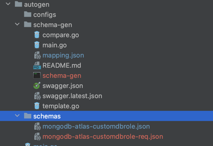

# Auto Generate cfn template and generic GO Code

## How to generate Resource setup and Respective Go template for a new Resource

### Step 1:

Update mapping.json in schema folder with new resource details (for this example we will use custom DB role)

the typeName must be in CapitalCase, as is a cloud formation standard

For Example:
``` json
{
  "resources" : [
    {
      "typeName" :"CustomDBRole",
      "openApiPath" : [
        "/api/atlas/v1.0/groups/{groupId}/customDBRoles/roles",
        "/api/atlas/v1.0/groups/{groupId}/customDBRoles/roles"
      ]
    }
  ]
}
```

### Step 2:
Run below command to generate schema file that is required for ``cfn generagte`` in the next step.
```bash
    make schema
``` 

this procedure should generate 2 files in the schema folder (custom db role for this example)



- mongodb-atlas-customdbrole.json : is the actual schema used to generate the resource
- mongodb-atlas-customdbrole-req.json : contains metadata related to the code generation, like potentially required fields, and fields that might be needed by the Atlas go Client

### Step 3:
Run make create command to generate Resource template which reads
/configs/<resource>-schema.json and /configs/<resource>-req.json

#### the make create requires 3 inputs:

- schemaFileName = is the name of the resource in the file schema, check the file created in the /schemas folder, for this example the schemaFileName is "customdbrole" (mongodb-atlas-**customdbrole**.json)
- dirName = is the name of the directory that will be used to store the resource, (dash case is the convention for the folder name) for this example we are using "custom-db-role"
- typeName = is the type name, used by cloud formation, (MongoDB::Atlas::{TypeName}) MUST BE THE SAME AS DESPLAYED in the schema generated in step 2 check the property typeName in the mongodb-atlas-customdbrole.json, for this example we are usign **CustomDBRole**

```bash
        make create dirName=custom-db-role resourceName=customdbrole typeName=CustomDBRole
```

After executing the command 2 inputs are requested, 
- Language (go is required)
- Go Import Path

```
Select a language for code generation:
[1] go
[2] java
[3] python36
[4] python37
(enter an integer):
>> 1
Enter the GO Import path
>> github.com/mongodb/mongodbatlas-cloudformation-resources/custom-db-role
```