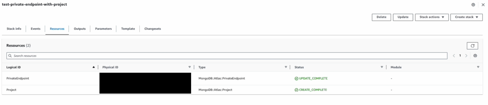
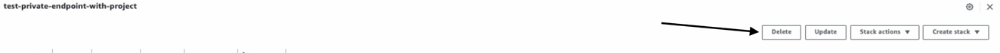
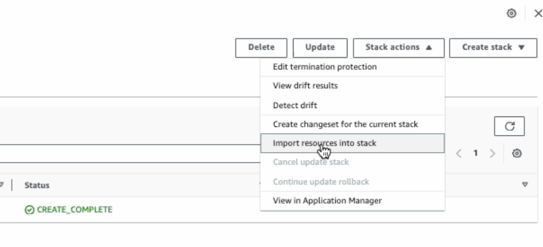
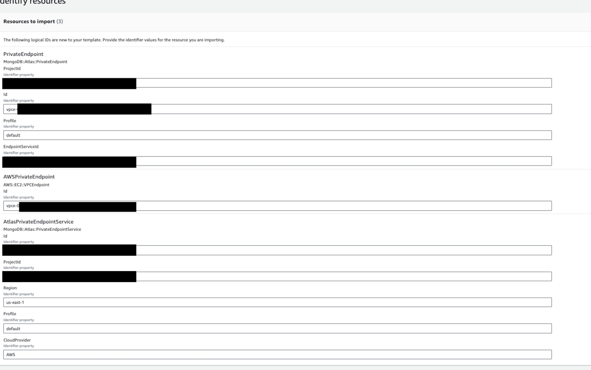
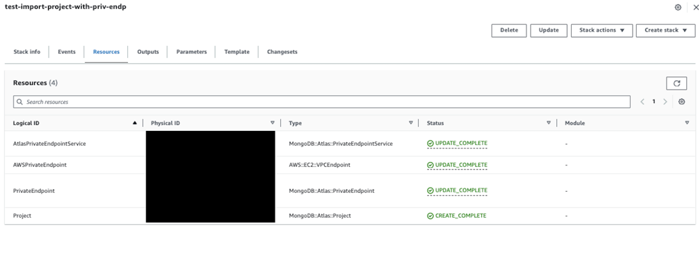

# V2 Private Endpoint Upgrade Guide

BEFORE UPDATING TO V2, in case the user has already updated to V2, contact AWS to downgrade to the previous version

## Document purpose
With the Private Endpoint V2 we have introduced the next changes:

PrivateEndpoint resource has been decided into two resources:
- **MongoDB::Atlas::PrivateEndpointService**: new, resource responsible for creating a Private Endpoint Service, unconfigured, and then using it to configure a Private Endpoint with AWS or any other provider
- **MongoDB::Atlas::PrivateEndpoint**: the current resource is modified, it is responsible for adding a privateEndpoint to the Service

Users currently utilizing the previous version of **MongoDB::Atlas::PrivateEndpoint** may need to update their existing
stacks to accommodate the new split version. This document aims to provide guidance on upgrading your current stacks to
leverage the new split private endpoint version, all without the necessity of deleting and recreating any of your existing
MongoDB Atlas or AWS private endpoints

## Cloud Formation Limitations
before we start with the upgrade progress we need to understand the next limitations:

- For the migration we will be using the IMPORT feature provided by CloudFormation, the import process is not fully supported for third party resources, and it has the next limitations:
  
  - the import does not support UPDATE DELETE or CREATE resources, it can only READ existing resources
  - the import process does not support changes or additions on any Output, so all the outputs that we want to modify or any reference to the imported resources, must be removed or hardcoded before the import, and later updated 

## Update process:
In this example, we will walk through an recommended update procedure. We'll start with an existing stack that includes a project and a private endpoint (V1), and then proceed to upgrade it to utilize the new Splited private endpoint V2, all without needing to make any changes to your existing MongoDB Atlas resources

**Go from this:**
>MongoDB::Atlas::Project
	MongoDB::Atlas::PrivateEndpoint

**To this:**
>MongoDB::Atlas::Project
MongoDB::Atlas::PrivateEndpointService
AWS::EC2::VPCEndpoint
MongoDB::Atlas::PrivateEndpoint

### Steps:

- **Step-1 : Adding DeletionPolicy**:  Setting the property **"DeletionPolicy" : "Retain"** to all resources with the old MongoDB::Atlas::PrivateEndpoint resource
- **Step-2 : Remove References to original private endpoint**: Remove all MongoDB::Atlas::PrivateEndpoint resources, and removing or hard coding any reference or output of any old original private endoint
- **Step-3 : Import new resources**: Initiate an Import process for the new resources
- **Step-4 : Update the Outputs**: Update the current stack to reset any reference or output removed or hardcoded on step 2

We are going to start with the next example:

``` json
{
   "AWSTemplateFormatVersion":"2010-09-09",
   "Description":"This template creates a Private Endpoint / Private Endpoint Service resource with AWS PrivateLink for Dedicated Clusters on MongoDB Atlas. This will be billed to your Atlas account.",
   "Parameters":{
      "Profile":{
         "Type":"String",
         "Description":"Atlas Profile name",
         "Default":"default"
      },
      "MongoDBAtlasProjectName":{
         "Type":"String",
         "Description":"MongoDB project Key"
      },
      "MongoDBAtlasOrgId":{
         "Type":"String",
         "Description":"MongoDB project Key"
      },
      "AWSRegion":{
         "Type":"String",
         "Description":"Cloud provider region for which you want to create the private endpoint service (example: us-east-1).",
         "Default":"us-east-1"
      },
      "AWSVpcId":{
         "Type":"String",
         "Description":"AWS VPC ID (like: vpc-xxxxxxxxxxxxxxxx) (Used For Creating the AWS VPC Endpoint)"
      },
      "AWSSubnetId":{
         "Type":"String",
         "Default":"subnet-",
         "Description":"AWS VPC Subnet ID (like: subnet-xxxxxxxxxxxxxxxxx) (Used For Creating the AWS VPC Endpoint)"
      }
   },
   "Mappings":{
      
   },
   "Resources":{
      "Project":{
         "Type":"MongoDB::Atlas::Project",
         "Properties":{
            "Name":{
               "Ref":"MongoDBAtlasProjectName"
            },
            "OrgId":{
               "Ref":"MongoDBAtlasOrgId"
            },
            "Profile":{
               "Ref":"Profile"
            }
         }
      },
      "PrivateEndpoint":{
         "Type":"MongoDB::Atlas::PrivateEndpoint",
         "Properties":{
            "GroupId":{
               "Fn::GetAtt":[
                  "Project",
                  "Id"
               ]
            },
            "Region":{
               "Ref":"AWSRegion"
            },
            "PrivateEndpoints":[
               {
                  "VpcId":{
                     "Ref":"AWSVpcId"
                  },
                  "SubnetIds":[
                     {
                        "Ref":"AWSSubnetId"
                     }
                  ]
               }
            ],
            "Profile":{
               "Ref":"Profile"
            }
         }
      }
   },
   "Outputs":{
      "PrivateEndpointId":{
         "Value":{
            "Fn::GetAtt":[
               "PrivateEndpoint",
               "Id"
            ]
         }
      }
   }
}
```

In this example we have a stack with a Project and a PrivateEndpoint V1



## Step-1 : Adding DeletionPolicy

In this step, we will incorporate the 'DeletionPolicy' : 'Retain' attribute into all references to private endpoints. 
This step is crucial because we intend to remove the old PrivateEndpoint from the stack and introduce the new structure,
ensuring that the actual ATLAS and AWS endpoint configurations remain intact when removing the reference from the stack.

> WARNING: this has to be done before upgrading to the new version, otherwise the stack is going to fail in the update
> in case of already having the V2 version, contact AWS to downgrade to the old V1 version

the stack should look like this
``` json
{
   "AWSTemplateFormatVersion":"2010-09-09",
   "Description":"This template creates a Private Endpoint / Private Endpoint Service resource with AWS PrivateLink for Dedicated Clusters on MongoDB Atlas. This will be billed to your Atlas account.",
   "Parameters":{
      "Profile":{
         "Type":"String",
         "Description":"Atlas Profile name",
         "Default":"default"
      },
      "MongoDBAtlasProjectName":{
         "Type":"String",
         "Description":"MongoDB project Key"
      },
      "MongoDBAtlasOrgId":{
         "Type":"String",
         "Description":"MongoDB project Key"
      },
      "AWSRegion":{
         "Type":"String",
         "Description":"Cloud provider region for which you want to create the private endpoint service (example: us-east-1).",
         "Default":"us-east-1"
      },
      "AWSVpcId":{
         "Type":"String",
         "Description":"AWS VPC ID (like: vpc-xxxxxxxxxxxxxxxx) (Used For Creating the AWS VPC Endpoint)"
      },
      "AWSSubnetId":{
         "Type":"String",
         "Default":"subnet-",
         "Description":"AWS VPC Subnet ID (like: subnet-xxxxxxxxxxxxxxxxx) (Used For Creating the AWS VPC Endpoint)"
      }
   },
   "Mappings":{
      
   },
   "Resources":{
      "Project":{
         "Type":"MongoDB::Atlas::Project",
         "Properties":{
            "Name":{
               "Ref":"MongoDBAtlasProjectName"
            },
            "OrgId":{
               "Ref":"MongoDBAtlasOrgId"
            },
            "Profile":{
               "Ref":"Profile"
            }
         }
      },
      "PrivateEndpoint":{
         "Type":"MongoDB::Atlas::PrivateEndpoint",
         "DeletionPolicy":"Retain",
         "Properties":{
            "GroupId":{
               "Fn::GetAtt":[
                  "Project",
                  "Id"
               ]
            },
            "Region":{
               "Ref":"AWSRegion"
            },
            "PrivateEndpoints":[
               {
                  "VpcId":{
                     "Ref":"AWSVpcId"
                  },
                  "SubnetIds":[
                     {
                        "Ref":"AWSSubnetId"
                     }
                  ]
               }
            ],
            "Profile":{
               "Ref":"Profile"
            }
         }
      }
   },
   "Outputs":{
      "PrivateEndpointId":{
         "Value":{
            "Fn::GetAtt":[
               "PrivateEndpoint",
               "Id"
            ]
         }
      }
   }
}
```

We need to input this new stack, in the stack update:



## Step-2 : Remove References to original private endpoint

We need to remove all references to the old private endpoint

``` json
{
  "AWSTemplateFormatVersion": "2010-09-09",
  "Description": "This template creates a Private Endpoint / Private Endpoint Service resource with AWS PrivateLink for Dedicated Clusters on MongoDB Atlas. This will be billed to your Atlas account.",
  "Parameters": {
    "Profile": {
      "Type": "String",
      "Description": "Atlas Profile name",
      "Default": "default"
    },
    "MongoDBAtlasProjectName": {
      "Type": "String",
      "Description": "MongoDB project Key"
    },
    "MongoDBAtlasOrgId": {
      "Type": "String",
      "Description": "MongoDB project Key"
    },
    "AWSRegion": {
      "Type": "String",
      "Description": "Cloud provider region for which you want to create the private endpoint service (example: us-east-1).",
      "Default": "us-east-1"
    },
    "AWSVpcId": {
      "Type": "String",
      "Description": "AWS VPC ID (like: vpc-xxxxxxxxxxxxxxxx) (Used For Creating the AWS VPC Endpoint)"
    },
    "AWSSubnetId": {
      "Type": "String",
      "Default": "subnet-",
      "Description": "AWS VPC Subnet ID (like: subnet-xxxxxxxxxxxxxxxxx) (Used For Creating the AWS VPC Endpoint)"
    }
  },
  "Mappings": {},
  "Resources": {
    "Project": {
      "Type": "MongoDB::Atlas::Project",
      "Properties": {
        "Name": {
          "Ref": "MongoDBAtlasProjectName"
        },
        "OrgId": {
          "Ref": "MongoDBAtlasOrgId"
        },
        "Profile": {
          "Ref": "Profile"
        }
      }
    }
  },
  "Outputs": {
    "PrivateEndpointId": {
      "Value": "6531fa9569795331fcc18778"
    }
  }
}
```

the update process should show a deleted resource

hardcoding any oputput or any reference to the old private endpoint

## Step-3 : Import new resources

the next step is to add the new structure to the stack

``` json
{
   "AWSTemplateFormatVersion":"2010-09-09",
   "Description":"This template creates a Private Endpoint / Private Endpoint Service resource with AWS PrivateLink for Dedicated Clusters on MongoDB Atlas. This will be billed to your Atlas account.",
   "Parameters":{
      "Profile":{
         "Type":"String",
         "Description":"Atlas Profile name",
         "Default":"default"
      },
      "MongoDBAtlasProjectName":{
         "Type":"String",
         "Description":"MongoDB project Key"
      },
      "MongoDBAtlasOrgId":{
         "Type":"String",
         "Description":"MongoDB project Key"
      },
      "AWSRegion":{
         "Type":"String",
         "Description":"Cloud provider region for which you want to create the private endpoint service (example: us-east-1).",
         "Default":"us-east-1"
      },
      "AWSVpcId":{
         "Type":"String",
         "Description":"AWS VPC ID (like: vpc-xxxxxxxxxxxxxxxx) (Used For Creating the AWS VPC Endpoint)"
      },
      "AWSSubnetId":{
         "Type":"String",
         "Default":"subnet-",
         "Description":"AWS VPC Subnet ID (like: subnet-xxxxxxxxxxxxxxxxx) (Used For Creating the AWS VPC Endpoint)"
      }
   },
   "Mappings":{
      
   },
   "Resources":{
      "Project":{
         "Type":"MongoDB::Atlas::Project",
         "Properties":{
            "Name":{
               "Ref":"MongoDBAtlasProjectName"
            },
            "OrgId":{
               "Ref":"MongoDBAtlasOrgId"
            },
            "Profile":{
               "Ref":"Profile"
            }
         }
      },
      "PrivateEndpoint":{
         "Type":"MongoDB::Atlas::PrivateEndpoint",
         "DeletionPolicy":"Retain",
         "Properties":{
            "GroupId":{
               "Fn::GetAtt":[
                  "Project",
                  "Id"
               ]
            },
            "Region":{
               "Ref":"AWSRegion"
            },
            "PrivateEndpoints":[
               {
                  "VpcId":{
                     "Ref":"AWSVpcId"
                  },
                  "SubnetIds":[
                     {
                        "Ref":"AWSSubnetId"
                     }
                  ]
               }
            ],
            "Profile":{
               "Ref":"Profile"
            }
         }
      }
   },
   "Outputs":{
      "PrivateEndpointId":{
         "Value":{
            "Fn::GetAtt":[
               "PrivateEndpoint",
               "Id"
            ]
         }
      }
   }
}
```

this should be done with the import option in the stack 



the first step of the import is to identify the resources that we must import



if the process is is finished successfully we should see something like this:


## Step-4 : Update the Outputs

since the import process does not allow modification in output values, we need to update the resource again 
to modify the references to any output we hardcoded before