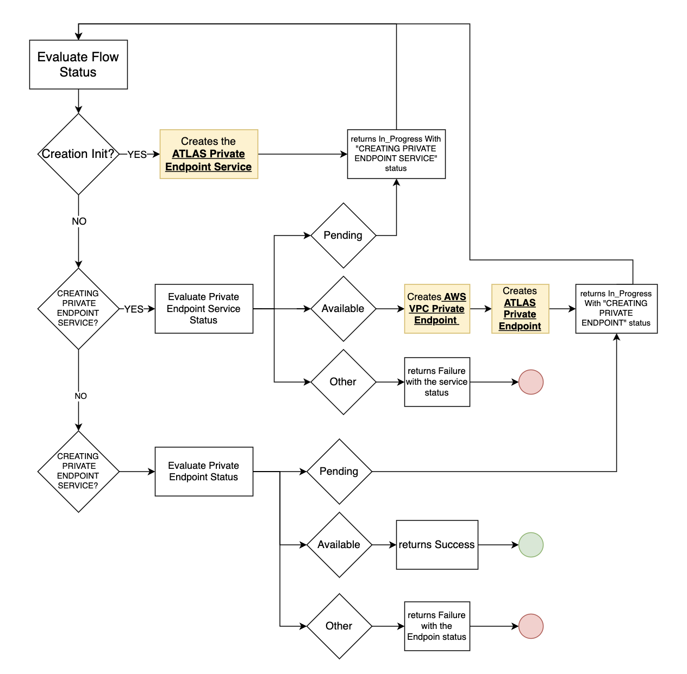

# MongoDB::Atlas::PrivateEndpoint

The Private Endpoint creation flow consists of the creation of three related resources in the next order.

1. Atlas Private Endpoint Service
2. Aws VPC private Endpoint
3. Atlas Private Endpoint

>Limitation: On this first Stage only one private endpoint can be attached to a service (future versions will support multiple Private Endpoints)

AWS PrivateLink supports 50 addressable targets, Atlas can use port 1024 through port 65535, but typically starts with port 1024. The ports can change under specific circumstances, including (but not limited to) cluster changes.

### CREATION FLOW

The creation process waits until all the resources gets created the next order

1. Creates the Private Endpoint Service and waits until is completed (Available Status)
2. Once the Private Endpoint Service gets completed, creates the Aws VPC Private endpoint and the Atlas Private Endpoint
3. Once the two last resources gets completed (Available Status) the flow returns Success

### SIMPLIFIED CREATION FLOW



## Attributes & Parameters

Please consult the [Resource Docs](docs/README.md)

## Local Testing

The local tests are integrated with the AWS `sam local` and `cfn invoke` tooling features:

```
sam local start-lambda --skip-pull-image
```
then in another shell:
```bash
repo_root=$(git rev-parse --show-toplevel)
source <(${repo_root}/quickstart-mongodb-atlas/scripts/export-mongocli-config.py)
cd ${repo_root}/cfn-resources/project
./test/project.create-sample-cfn-request.sh YourProjectName > test.request.json 
echo "Sample request:"
cat test.request.json
cfn invoke CREATE test.request.json 
cfn invoke DELETE test.request.json 
```

Both CREATE & DELETE tests must pass.

## Installation
TAGS=logging make
cfn submit --verbose --set-default

## Usage

The [/quickstart-mongodb-atlas/scripts/launch-x-quickstart.sh](launch-x-quickstart.sh) script
can be used to safely inject your MongoDB Cloud ApiKey environment variables into an example
CloudFormation stack template along with the other neccessary parameters.

You can use the project.sample-template.yaml to create a stack using the resource.
Similar to the local testing described above you can follow the logs for the deployed
lambda function which handles the request for the Resource Type.

In one shell session:
```
aws logs tail mongodb-atlas-project-logs --follow
```

And then you can create the stack with a helper script it insert the apikeys for you:


```bash
repo_root=$(git rev-parse --show-toplevel)
source <(${repo_root}/quickstart-mongodb-atlas/scripts/export-mongocli-config.py)
${repo_root}/quickstart-mongodb-atlas/scripts/launch-x-quickstart.sh ${repo_root}/cfn-resources/project/test/project.sample-template.yaml SampleProject1 ParameterKey=OrgId,ParameterValue=${ATLAS_ORG_ID}
```

## For More Information
See the MongoDB Atlas API [Project Endpoint](https://www.mongodb.com/docs/atlas/reference/api-resources-spec/#tag/Projects) Documentation.
