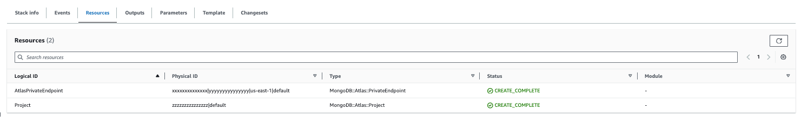
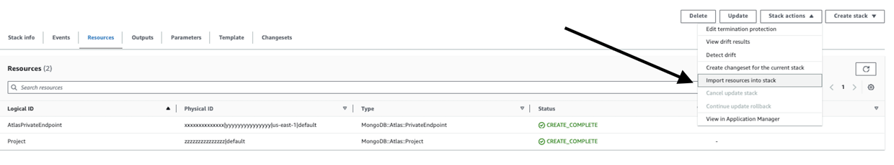
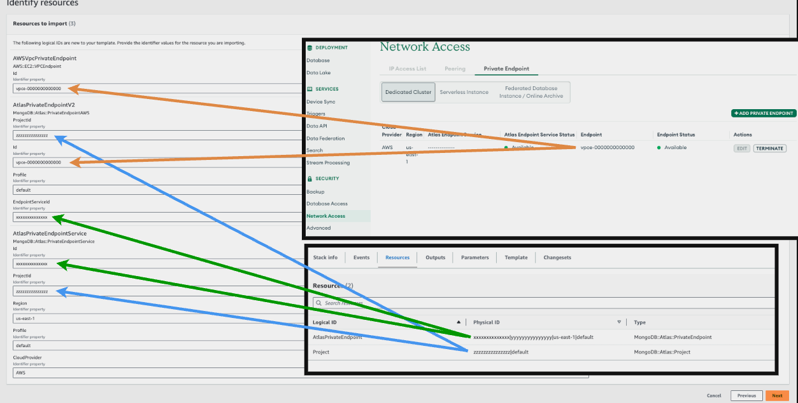
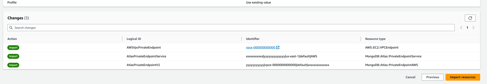
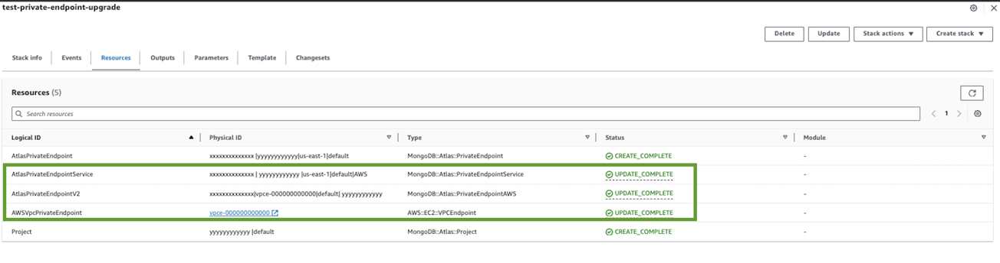
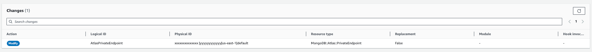
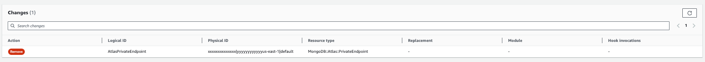
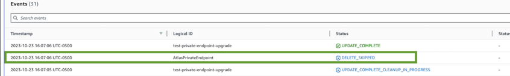

# V2 Private Endpoint Upgrade Guide

## Document purpose
With the Private Endpoint V2 we have introduced the next changes:

PrivateEndpoint resource has been divided into two resources:
- **MongoDB::Atlas::PrivateEndpointService**: new, resource responsible for creating a Private Endpoint Service, unconfigured, and then using it to configure a Private Endpoint with AWS or any other provider
- **MongoDB::Atlas::PrivateEndpointAWS**: the current resource is modified, it is responsible for adding a privateEndpoint to the Service

The current **MongoDB::Atlas::PrivateEndpoint** will be marked as DEPRECATED

Users currently utilizing the previous version of **MongoDB::Atlas::PrivateEndpoint** may need to update their existing
stacks to accommodate the new split version. This document aims to provide guidance on upgrading your current stacks to
leverage the new split private endpoint version, all without the necessity of deleting and recreating any of your existing
MongoDB Atlas or AWS private endpoints

## Cloud Formation Limitations
For the migration we will be using the IMPORT feature provided by CloudFormation. Before we start with the upgrade progress we need to understand the [Import Requirements and Considerations](https://github.com/mongodb/mongodbatlas-cloudformation-resources/blob/master/cfn-resources/README.md#resource-import-operations)

## Update process:
In this example, we will walk through a recommended update procedure. We'll start with an existing stack that includes a project and a private endpoint (V1), and then proceed to upgrade it to utilize the new Splited private endpoint V2, all without needing to make any changes to your existing MongoDB Atlas resources

**Go from this:**
>MongoDB::Atlas::Project
	MongoDB::Atlas::PrivateEndpoint

**To this:**
>MongoDB::Atlas::Project
MongoDB::Atlas::PrivateEndpointService
AWS::EC2::VPCEndpoint
MongoDB::Atlas::PrivateEndpointAWS

### Steps:

- **Step-1 : Import new resources**: We will import the existing resources into the current stack
- **Step-2 : Remove References to original private endpoint**: Remove all MongoDB::Atlas::PrivateEndpoint references
  - **Step-2-a Add DeletionPolicy** : Update the old private endpoint references with the "DeletionPolicy" : "Retain"
  - **Step-2-b Remove References** : remove all references to the V1 Private Endpoint

We are going to start with the next example:

``` json
{
  "AWSTemplateFormatVersion": "2010-09-09",
  "Description": "This template creates a Private Endpoint / Private Endpoint Service resource with AWS PrivateLink for Dedicated Clusters on MongoDB Atlas. This will be billed to your Atlas account.",
  "Parameters": {
    "Profile": {
      "Type": "String",
      "Description": "Atlas Profile name",
      "Default": "default"
    },
    "MongoDBAtlasProjectName": {
      "Type": "String",
      "Description": "MongoDB project Key"
    },
    "MongoDBAtlasOrgId": {
      "Type": "String",
      "Description": "MongoDB project Key"
    },
    "AWSRegion": {
      "Type": "String",
      "Description": "Cloud provider region for which you want to create the private endpoint service (example: us-east-1).",
      "Default": "us-east-1"
    },
    "AWSVpcId": {
      "Type": "String",
      "Description": "AWS VPC ID (like: vpc-xxxxxxxxxxxxxxxx) (Used For Creating the AWS VPC Endpoint)"
    },
    "AWSSubnetId": {
      "Type": "String",
      "Default": "subnet-",
      "Description": "AWS VPC Subnet ID (like: subnet-xxxxxxxxxxxxxxxxx) (Used For Creating the AWS VPC Endpoint)"
    }
  },
  "Mappings": {},
  "Resources": {
    "Project": {
      "Type": "MongoDB::Atlas::Project",
      "Properties": {
        "Name": {
          "Ref": "MongoDBAtlasProjectName"
        },
        "OrgId": {
          "Ref": "MongoDBAtlasOrgId"
        },
        "Profile": {
          "Ref": "Profile"
        }
      }
    },
    "AtlasPrivateEndpoint": {
      "Type": "MongoDB::Atlas::PrivateEndpoint",
      "Properties": {
        "GroupId": {
          "Fn::GetAtt": [
            "Project",
            "Id"
          ]
        },
        "Region": {
          "Ref": "AWSRegion"
        },
        "PrivateEndpoints": [
          {
            "VpcId": {
              "Ref": "AWSVpcId"
            },
            "SubnetIds": [
              {
                "Ref": "AWSSubnetId"
              }
            ]
          }
        ],
        "Profile": {
          "Ref": "Profile"
        }
      }
    }
  },
  "Outputs": {
    "PrivateEndpointId": {
      "Value": {
        "Fn::GetAtt": [
          "AtlasPrivateEndpoint",
          "Id"
        ]
      }
    }
  }
}
```

In this example we have a stack with a Project and a PrivateEndpoint V1




## Step-1 :  Import new resources

We need to add the three new resources to the current stack, making sure that we don't delete or modify the original
private endpoint, or any Output, since the Import process does not support modifications on Outputs

> - MongoDB::Atlas::PrivateEndpointService 
> - AWS::EC2::VPCEndpoint 
> - MongoDB::Atlas::PrivateEndpointAWS

the Stack should look like this:
``` json
{
  "AWSTemplateFormatVersion": "2010-09-09",
  "Description": "This template creates a Private Endpoint / Private Endpoint Service resource with AWS PrivateLink for Dedicated Clusters on MongoDB Atlas. This will be billed to your Atlas account.",
  "Parameters": {
    "Profile": {
      "Type": "String",
      "Description": "Atlas Profile name",
      "Default": "default"
    },
    "MongoDBAtlasProjectName": {
      "Type": "String",
      "Description": "MongoDB project Key"
    },
    "MongoDBAtlasOrgId": {
      "Type": "String",
      "Description": "MongoDB project Key"
    },
    "AWSRegion": {
      "Type": "String",
      "Description": "Cloud provider region for which you want to create the private endpoint service (example: us-east-1).",
      "Default": "us-east-1"
    },
    "AWSVpcId": {
      "Type": "String",
      "Description": "AWS VPC ID (like: vpc-xxxxxxxxxxxxxxxx) (Used For Creating the AWS VPC Endpoint)"
    },
    "AWSSubnetId": {
      "Type": "String",
      "Default": "subnet-",
      "Description": "AWS VPC Subnet ID (like: subnet-xxxxxxxxxxxxxxxxx) (Used For Creating the AWS VPC Endpoint)"
    }
  },
  "Mappings": {},
  "Resources": {
    "Project": {
      "Type": "MongoDB::Atlas::Project",
      "Properties": {
        "Name": {
          "Ref": "MongoDBAtlasProjectName"
        },
        "OrgId": {
          "Ref": "MongoDBAtlasOrgId"
        },
        "Profile": {
          "Ref": "Profile"
        }
      }
    },
    "AtlasPrivateEndpoint": {
      "Type": "MongoDB::Atlas::PrivateEndpoint",
      "Properties": {
        "GroupId": {
          "Fn::GetAtt": [
            "Project",
            "Id"
          ]
        },
        "Region": {
          "Ref": "AWSRegion"
        },
        "PrivateEndpoints": [
          {
            "VpcId": {
              "Ref": "AWSVpcId"
            },
            "SubnetIds": [
              {
                "Ref": "AWSSubnetId"
              }
            ]
          }
        ],
        "Profile": {
          "Ref": "Profile"
        }
      }
    },
    "AtlasPrivateEndpointService": {
      "Type": "MongoDB::Atlas::PrivateEndpointService",
      "DeletionPolicy" : "Retain",
      "Properties": {
        "ProjectId": { "Fn::GetAtt" : [ "Project", "Id" ] },
        "Region": {
          "Ref": "AWSRegion"
        },
        "Profile": {
          "Ref": "Profile"
        },
        "CloudProvider": "AWS"
      }
    },
    "AWSVpcPrivateEndpoint": {
      "Type": "AWS::EC2::VPCEndpoint",
      "DeletionPolicy" : "Retain",
      "DependsOn": "AtlasPrivateEndpointService",
      "Properties": {
        "ServiceName": {
          "Fn::GetAtt": [
            "AtlasPrivateEndpointService",
            "EndpointServiceName"
          ]
        },
        "SubnetIds": [
          {
            "Ref": "AWSSubnetId"
          }
        ],
        "VpcEndpointType": "Interface",
        "VpcId": {
          "Ref": "AWSVpcId"
        }
      }
    },
    "AtlasPrivateEndpointV2": {
      "Type": "MongoDB::Atlas::PrivateEndpointAWS",
      "DeletionPolicy" : "Retain",
      "DependsOn": "AWSVpcPrivateEndpoint",
      "Properties": {
        "ProjectId": { "Fn::GetAtt" : [ "Project", "Id" ] },
        "EndpointServiceId": {
          "Fn::GetAtt": [
            "AtlasPrivateEndpointService",
            "Id"
          ]
        },
        "Profile": {
          "Ref": "Profile"
        },
        "Id" : {
          "Fn::GetAtt": [
            "AWSVpcPrivateEndpoint",
            "Id"
          ]
        }
      }
    }
  },
  "Outputs": {
    "PrivateEndpointId": {
      "Value": {
        "Fn::GetAtt": [
          "AtlasPrivateEndpoint",
          "Id"
        ]
      }
    }
  }
}
``` 

We are using the Import resources into current stack option in the stack:


in the first step we need to specify the identifiers of each resource:


in the final screen we should see all the imported resources:



if the process is success we should see the three new resources on the stack:


## Step-2 : Remove References to original private endpoint

In this final step, we will eliminate all references to the original private endpoint.
Prior to proceeding, we must ensure that all previous mentions of the private endpoint include the 'DeletionPolicy' : 'Retain'
option. This step guarantees that the current private endpoint remains intact when we remove the resource from the stack.

### Step-2-a : Adding the DeletionPolicy to the private endpoint
In this step, we will incorporate the 'DeletionPolicy' : 'Retain' attribute into all references to private endpoints. 
This step is crucial because we intend to remove the old PrivateEndpoint from the stack,
ensuring that the actual ATLAS and AWS endpoint configurations remain intact when removing the reference from the stack.

the stack should look like this
``` json
{
  "AWSTemplateFormatVersion": "2010-09-09",
  "Description": "This template creates a Private Endpoint / Private Endpoint Service resource with AWS PrivateLink for Dedicated Clusters on MongoDB Atlas. This will be billed to your Atlas account.",
  "Parameters": {
    "Profile": {
      "Type": "String",
      "Description": "Atlas Profile name",
      "Default": "default"
    },
    "MongoDBAtlasProjectName": {
      "Type": "String",
      "Description": "MongoDB project Key"
    },
    "MongoDBAtlasOrgId": {
      "Type": "String",
      "Description": "MongoDB project Key"
    },
    "AWSRegion": {
      "Type": "String",
      "Description": "Cloud provider region for which you want to create the private endpoint service (example: us-east-1).",
      "Default": "us-east-1"
    },
    "AWSVpcId": {
      "Type": "String",
      "Description": "AWS VPC ID (like: vpc-xxxxxxxxxxxxxxxx) (Used For Creating the AWS VPC Endpoint)"
    },
    "AWSSubnetId": {
      "Type": "String",
      "Default": "subnet-",
      "Description": "AWS VPC Subnet ID (like: subnet-xxxxxxxxxxxxxxxxx) (Used For Creating the AWS VPC Endpoint)"
    }
  },
  "Mappings": {},
  "Resources": {
    "Project": {
      "Type": "MongoDB::Atlas::Project",
      "Properties": {
        "Name": {
          "Ref": "MongoDBAtlasProjectName"
        },
        "OrgId": {
          "Ref": "MongoDBAtlasOrgId"
        },
        "Profile": {
          "Ref": "Profile"
        }
      }
    },
    "AtlasPrivateEndpoint": {
      "Type": "MongoDB::Atlas::PrivateEndpoint",
      "DeletionPolicy" : "Retain",
      "Properties": {
        "GroupId": {
          "Fn::GetAtt": [
            "Project",
            "Id"
          ]
        },
        "Region": {
          "Ref": "AWSRegion"
        },
        "PrivateEndpoints": [
          {
            "VpcId": {
              "Ref": "AWSVpcId"
            },
            "SubnetIds": [
              {
                "Ref": "AWSSubnetId"
              }
            ]
          }
        ],
        "Profile": {
          "Ref": "Profile"
        }
      }
    },
    "AtlasPrivateEndpointService": {
      "Type": "MongoDB::Atlas::PrivateEndpointService",
      "DeletionPolicy" : "Retain",
      "Properties": {
        "ProjectId": { "Fn::GetAtt" : [ "Project", "Id" ] },
        "Region": {
          "Ref": "AWSRegion"
        },
        "Profile": {
          "Ref": "Profile"
        },
        "CloudProvider": "AWS"
      }
    },
    "AWSVpcPrivateEndpoint": {
      "Type": "AWS::EC2::VPCEndpoint",
      "DeletionPolicy" : "Retain",
      "DependsOn": "AtlasPrivateEndpointService",
      "Properties": {
        "ServiceName": {
          "Fn::GetAtt": [
            "AtlasPrivateEndpointService",
            "EndpointServiceName"
          ]
        },
        "SubnetIds": [
          {
            "Ref": "AWSSubnetId"
          }
        ],
        "VpcEndpointType": "Interface",
        "VpcId": {
          "Ref": "AWSVpcId"
        }
      }
    },
    "AtlasPrivateEndpointV2": {
      "Type": "MongoDB::Atlas::PrivateEndpointAWS",
      "DeletionPolicy" : "Retain",
      "DependsOn": "AWSVpcPrivateEndpoint",
      "Properties": {
        "ProjectId": { "Fn::GetAtt" : [ "Project", "Id" ] },
        "EndpointServiceId": {
          "Fn::GetAtt": [
            "AtlasPrivateEndpointService",
            "Id"
          ]
        },
        "Profile": {
          "Ref": "Profile"
        },
        "Id" : {
          "Fn::GetAtt": [
            "AWSVpcPrivateEndpoint",
            "Id"
          ]
        }
      }
    }
  },
  "Outputs": {
    "PrivateEndpointId": {
      "Value": {
        "Fn::GetAtt": [
          "AtlasPrivateEndpoint",
          "Id"
        ]
      }
    }
  }
}
```

for this we are executing an UPDATE with the new stack

we should see a Modify changed with Replacement = false


### Step-2-b Remove References
Assuming all the preceding steps have been completed successfully, we are now prepared to retire the V1 private endpoint reference.
Additionally, we need to remember to update all previous references to the new PrivateEndpoint Resources.

``` json
{
  "AWSTemplateFormatVersion": "2010-09-09",
  "Description": "This template creates a Private Endpoint / Private Endpoint Service resource with AWS PrivateLink for Dedicated Clusters on MongoDB Atlas. This will be billed to your Atlas account.",
  "Parameters": {
    "Profile": {
      "Type": "String",
      "Description": "Atlas Profile name",
      "Default": "default"
    },
    "MongoDBAtlasProjectName": {
      "Type": "String",
      "Description": "MongoDB project Key"
    },
    "MongoDBAtlasOrgId": {
      "Type": "String",
      "Description": "MongoDB project Key"
    },
    "AWSRegion": {
      "Type": "String",
      "Description": "Cloud provider region for which you want to create the private endpoint service (example: us-east-1).",
      "Default": "us-east-1"
    },
    "AWSVpcId": {
      "Type": "String",
      "Description": "AWS VPC ID (like: vpc-xxxxxxxxxxxxxxxx) (Used For Creating the AWS VPC Endpoint)"
    },
    "AWSSubnetId": {
      "Type": "String",
      "Default": "subnet-",
      "Description": "AWS VPC Subnet ID (like: subnet-xxxxxxxxxxxxxxxxx) (Used For Creating the AWS VPC Endpoint)"
    }
  },
  "Mappings": {},
  "Resources": {
    "Project": {
      "Type": "MongoDB::Atlas::Project",
      "Properties": {
        "Name": {
          "Ref": "MongoDBAtlasProjectName"
        },
        "OrgId": {
          "Ref": "MongoDBAtlasOrgId"
        },
        "Profile": {
          "Ref": "Profile"
        }
      }
    },
    "AtlasPrivateEndpointService": {
      "Type": "MongoDB::Atlas::PrivateEndpointService",
      "DeletionPolicy" : "Retain",
      "Properties": {
        "ProjectId": { "Fn::GetAtt" : [ "Project", "Id" ] },
        "Region": {
          "Ref": "AWSRegion"
        },
        "Profile": {
          "Ref": "Profile"
        },
        "CloudProvider": "AWS"
      }
    },
    "AWSVpcPrivateEndpoint": {
      "Type": "AWS::EC2::VPCEndpoint",
      "DeletionPolicy" : "Retain",
      "DependsOn": "AtlasPrivateEndpointService",
      "Properties": {
        "ServiceName": {
          "Fn::GetAtt": [
            "AtlasPrivateEndpointService",
            "EndpointServiceName"
          ]
        },
        "SubnetIds": [
          {
            "Ref": "AWSSubnetId"
          }
        ],
        "VpcEndpointType": "Interface",
        "VpcId": {
          "Ref": "AWSVpcId"
        }
      }
    },
    "AtlasPrivateEndpointV2": {
      "Type": "MongoDB::Atlas::PrivateEndpointAWS",
      "DeletionPolicy" : "Retain",
      "DependsOn": "AWSVpcPrivateEndpoint",
      "Properties": {
        "ProjectId": { "Fn::GetAtt" : [ "Project", "Id" ] },
        "EndpointServiceId": {
          "Fn::GetAtt": [
            "AtlasPrivateEndpointService",
            "Id"
          ]
        },
        "Profile": {
          "Ref": "Profile"
        },
        "Id" : {
          "Fn::GetAtt": [
            "AWSVpcPrivateEndpoint",
            "Id"
          ]
        }
      }
    }
  },
  "Outputs": {
    "PrivateEndpointId": {
      "Value": {
        "Fn::GetAtt": [
          "AtlasPrivateEndpointService",
          "Id"
        ]
      }
    }
  }
}
```

the process is the same as step 2-a, just update the current stack with the new template
in the last step we should see a changed marked as Removed:



the resource now should appear as DELETE_SKIPPED

