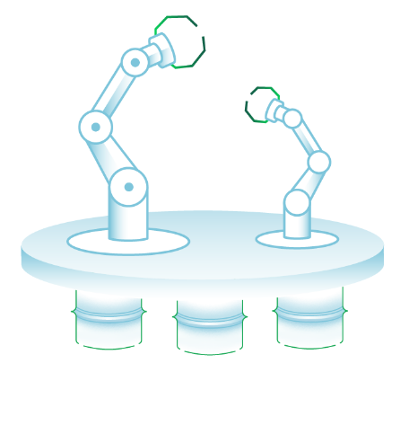

quickstart-mongodbatlas
=============
## MongoDB Atlas on the AWS Cloud

Start here: [beta-launch.md](beta-launch.md)

This Quick Start sets up a flexible, scalable AWS environment for MongoDB Atlas through AWS CloudFormation resources.

MongoDB Atlas is the global cloud database service for modern applications. Deploy fully managed MongoDB across AWS, Azure, or GCP. Best-in-class automation and proven practices guarantee availability, scalability, and compliance with the most demanding data security and privacy standards.

The Quick Start offers two deployment options:

- Deploying MongoDB Atlas into a new virtual private cloud (VPC) on AWS
- Deploying MongoDB Atlas into an existing VPC on AWS

You can also use the (sample)[templates/mongodbatlas-cfn-quickstart.template.json] AWS CloudFormation templates as a starting point for your own implementation.

:construction: 

:construction: 

For architectural details, best practices, step-by-step instructions, and customization options, see the 
[deployment guide](atlas-cfn-dataplatform.png).

To post feedback, submit feature ideas, or report bugs, use the **Issues** section of this GitHub repo.

