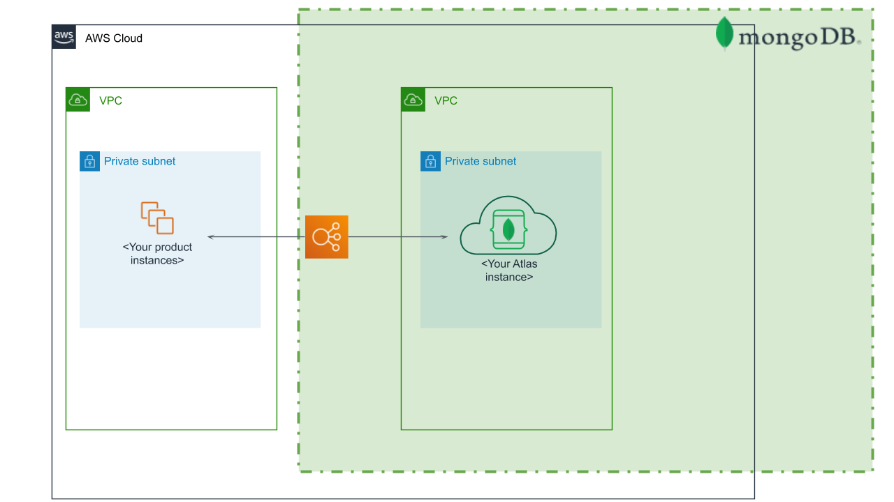

Deploying this Quick Start with peering for a new VPC with
default parameters builds the following _{partner-product-short-name}_ environment in the
AWS Cloud.

// Replace this example diagram with your own. Send us your source PowerPoint file. Be sure to follow our guidelines here : http://(we should include these points on our contributors giude)
[#architecture1]
.Quick Start architecture for _{partner-product-short-name}_
[link=images/simple-quickstart-arch.png]

As shown in Figure 1, the Quick Start sets up the following:

* A VPC that spans two Availability Zones. The VPC is configured with public subnets, according to AWS best practices, to provide you with your own virtual network on AWS.*
* In the public subnets, managed network address translation (NAT) gateways to allow outbound internet access.*
* A VPC peering connection between your VPC and the MongoDB Atlas VPC.
* A VPC for the MongoDB Atlas project that spans at least three Availability Zones. This includes a fully managed MongoDB Atlas cluster, a database user, and an IP access list entry.

*The template that deploys the Quick Start into an existing VPC skips
the components marked by asterisks and prompts you for your existing VPC
configuration.

Deploying Atlas without peering is the simplest deployment option. It skips the VPC resources and creates only MongoDB Atlas resources using MongoDB CloudFormation resource types.
