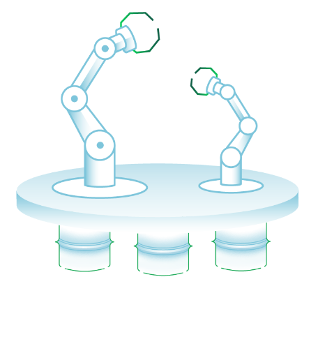

quickstart-mongodbatlas
=============
## MongoDB Atlas on the AWS Cloud

### Status: early-ALPHA (actively looking for feedback)

Start here: [beta-launch.md](beta-launch.md)

This Quick Start sets up a flexible, scalable AWS environment for MongoDB Atlas through AWS CloudFormation resources.

|marketing-update-here|MongoDB Atlas is an open source, NoSQL database that provides support for JSON-styled, document-oriented storage systems. 
Its flexible data model enables you to store data of any structure, and it provides full index support, sharding, and replication.

The Quick Start offers two deployment options:

- Deploying MongoDB Atlas into a new virtual private cloud (VPC) on AWS
- Deploying MongoDB Atlas into an existing VPC on AWS

You can also use the (sample)[sample] AWS CloudFormation templates as a starting point for your own implementation.

:construction: 

:construction: 

For architectural details, best practices, step-by-step instructions, and customization options, see the 
[deployment guide](atlas-cfn-dataplatform.png).

To post feedback, submit feature ideas, or report bugs, use the **Issues** section of this GitHub repo.
If you'd like to submit code for this Quick Start, please review the [AWS Quick Start Contributor's Kit](https://aws-quickstart.github.io/). 
